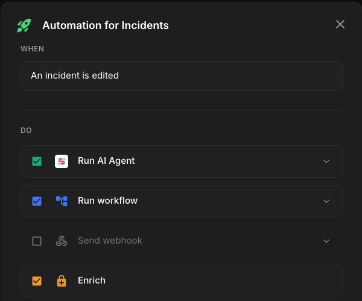

<div align="center">


# Shuffle Security

[Shuffle Security](https://security.shuffler.io) is the open source incident response and security operations frontend for [Shuffle](https://shuffler.io) — built for and by security professionals. It brings alerts, cases, observables, assets and AI-driven response into a single workspace, designed to work well for SOC teams, MSSPs and service providers.

[_Key Features_](https://security.shuffler.io/#features) — [_Community & Support_](https://discord.gg/B2CBzUm) — [_Documentation_](https://security.shuffler.io/docs) — [_Getting Started_](https://security.shuffler.io/docs/getting-started) — [_Set up a demo call_](https://shuffler.io/contact)

Follow us on Twitter at [@shuffleio](https://twitter.com/shuffleio).

</div>

<table align="center">
  <tr>
    <td width="50%" align="center">
      <a href="https://security.shuffler.io/incidents"></a><br/>
      <sub><a href="https://security.shuffler.io/incidents"><b>Handle incidents from any source</b></a><br/>One unified view for alerts, cases and tickets across every tool.</sub>
    </td>
    <td width="50%" align="center">
      <a href="https://security.shuffler.io/automation"></a><br/>
      <sub><a href="https://security.shuffler.io/monitors"><b>Set up host monitors</b></a><br/>For compliance, vulnerabilities and response across your fleet.</sub>
    </td>
  </tr>
  <tr>
    <td width="50%" align="center">
      <a href="https://security.shuffler.io/monitors"></a><br/>
      <sub><a href="https://security.shuffler.io/automation"><b>Be in control of the automation</b></a><br/>Visual ingest and forward pipelines you can shape end-to-end.</sub>
    </td>
    <td width="50%" align="center">
      <a href="https://security.shuffler.io/vulnerabilities"></a><br/>
      <sub><a href="https://security.shuffler.io/vulnerabilities"><b>Track and manage vulnerabilities</b></a><br/>Stay on top of risk over time across every asset and user.</sub>
    </td>
  </tr>
</table>

<div align="center">

## Try it

</div>

* Cloud: Register at [https://shuffler.io/register](https://shuffler.io/register) and get cooking
* Self-hosted: Check out the [installation guide](https://github.com/shuffle/shuffle/blob/master/.github/install-guide.md)
* Hosted UI: [https://security.shuffler.io](https://security.shuffler.io)

Please consider [sponsoring](https://github.com/sponsors/frikky) the project if you want to see more rapid development.

## Support
* [Discord](https://discord.gg/B2CBzUm)
* [Twitter](https://twitter.com/shuffleio)
* [Email](mailto:support@shuffler.io)
* [Open issue](https://github.com/shuffle/shuffle-security/issues/new)
* [Shuffler.io](https://shuffler.io/contact)

## Related repositories
* Shuffle (core platform): [https://github.com/shuffle/shuffle](https://github.com/shuffle/shuffle)
* OpenAPI apps: [https://github.com/shuffle/security-openapis](https://github.com/shuffle/security-openapis)
* Documentation: [https://github.com/shuffle/shuffle-docs](https://github.com/shuffle/shuffle-docs)
* Workflows: [https://github.com/shuffle/shuffle-workflows](https://github.com/shuffle/shuffle-workflows)
* Python apps: [https://github.com/shuffle/python-apps](https://github.com/shuffle/python-apps)

## Features
* Unified Incidents view (OCSF 2005) for alerts and cases
* Observables, assets and IOC correlation with threat intel enrichment
* AI Agent for triage, response suggestions and approvals
* Automation pipelines for ingest and forwarding
* Multi-tenant / sub-organization support for MSSPs
* 3,000+ integrations via the Apps catalog

## Documentation
[Documentation](https://shuffler.io/docs) can be found on [https://shuffler.io/docs](https://shuffler.io/docs) and is written here: [https://github.com/shuffle/shuffle-docs](https://github.com/shuffle/shuffle-docs).

### Setting up a local development environment

```bash
npm install
npm run dev
```

Configure the API target via a `.env` file in the project root:

```env
VITE_SHUFFLE_API_URL=https://shuffler.io
```

See the [Setup Guide](/docs/setup) for detailed configuration instructions.
