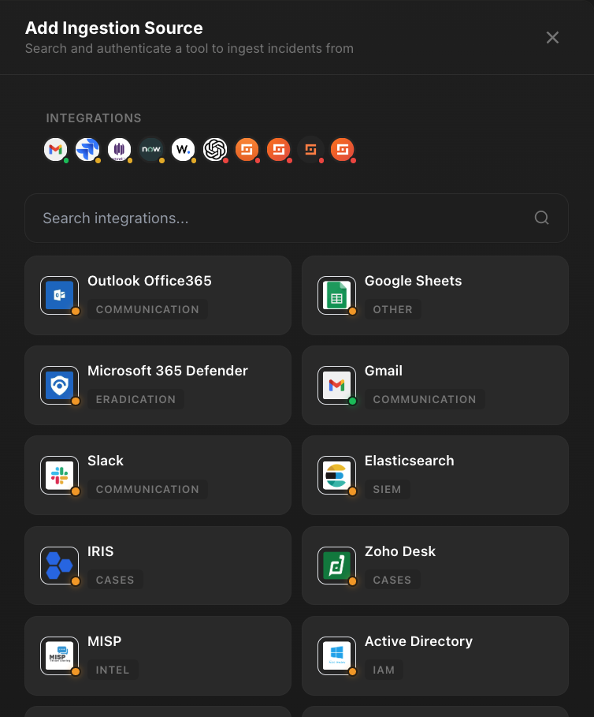
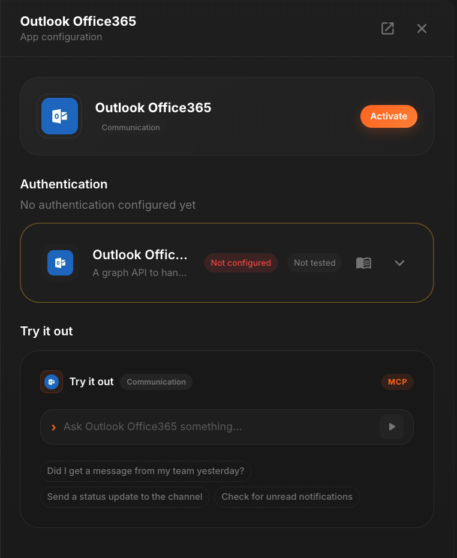

<div align="center">


# Shuffle MCP

Turn 3,000+ SaaS tools into MCP servers your agents can use. One search, one click, authenticated.

[](https://www.npmjs.com/package/shuffle-mcps)
[](./LICENSE)
[](https://github.com/Shuffle/singul.js)

</div>

---

<table align="center">
  <tr>
    <td align="center" width="50%">
      
      <br/><sub><b>1. Search any of 3,000+ tools</b></sub>
    </td>
    <td align="center" width="50%">
      
      <br/><sub><b>2. Authenticate and use as MCP</b></sub>
    </td>
  </tr>
</table>

&nbsp;

A headless React component for app discovery, selection, and OAuth handoff. Powers integration drawers, onboarding flows, and app pickers. Works zero-config against Shuffle's public Algolia index, or point it at your own.

## Install

```bash
npm install singul-integrations
```

Peer deps: `react >= 18`, `react-dom >= 18`, `algoliasearch >= 5`.

## Quick start

```tsx
import { SingulJS } from 'singul-integrations';

export default function App() {
  return (
    <SingulJS
      authToken="any-token"
      inline
      layout="grid"
      gridColumns={3}
      onAppSelected={(d) => console.log('picked', d.app.name)}
    />
  );
}
```

## Recipes

### Search → detail drawer

The most common pattern. Set `preventDefault` and handle `onAppSelected` to chain into your own auth or detail UI:

```tsx
<SingulJS
  authToken={token}
  inline
  preventDefault
  onAppSelected={(d) => openDetailDrawer(d.app)}
/>
```

Full two-drawer reference implementation: [`src/components/shared/AppSearchDrawer.tsx`](../components/shared/AppSearchDrawer.tsx).

### Predefined search

```tsx
<SingulJS
  authToken="..."
  inline
  initialFilterQuery="siem"
  placeholder="Search SIEM tools..."
/>
```

### Multi-select

```tsx
const [picked, setPicked] = useState<AlgoliaSearchApp[]>([]);

<SingulJS
  authToken="..."
  inline
  multiSelect
  showCheckbox
  selectedApps={picked}
  onSelectionChange={setPicked}
/>
```

### Your own backend

```tsx
<SingulJS
  authToken={user.token}
  apiKey={user.apiKey}
  apiBaseUrl="https://your-backend.example.com"
  algoliaAppId="YOUR_APP_ID"
  algoliaApiKey="YOUR_SEARCH_KEY"
/>
```

When `apiKey` is set, status dots appear: validated, configured, selected, inactive.

## Common props

| Prop | Type | Description |
|---|---|---|
| `authToken` | `string` | Required. Forwarded into the auth URL. |
| `inline` | `boolean` | Inline results vs floating dropdown. |
| `layout` | `'list' \| 'grid'` | Result layout. Default `'list'`. |
| `initialFilterQuery` | `string` | Pre-filter without filling the input. |
| `preventDefault` | `boolean` | Skip default `window.open(authUrl)` so you can handle selection. |
| `onAppSelected` | `(detail) => void` | Fires on single-select pick. |
| `multiSelect` | `boolean` | Allow selecting multiple apps. |
| `apiKey` | `string` | Bearer token. Enables status dots. |
| `customStyles` | `CustomStyles` | Per-slot style overrides. |

Full prop reference, framework setup (Next.js, Vue), styling slots, custom rendering, and publishing: [**LIBRARY.md**](./LIBRARY.md).

## Imperative handle

```tsx
const ref = useRef<SingulJSHandle>(null);
<SingulJS ref={ref} authToken="..." inline />

ref.current?.search('slack');
ref.current?.clear();
```

## Next.js

The component touches `window`, so render it client-side with `'use client'` or `next/dynamic({ ssr: false })`. See [LIBRARY.md](./LIBRARY.md#nextjs) for details.
